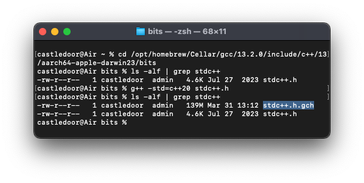

## gcc(g++) 컴파일러를 사용해 PCH를 만드려면:

1. include path로 이동  
  
2. `g++ -std=c++20 stdc++.h` 명령어로 stdc++.h 헤더 파일을 컴파일
    - 플래그에 `-std=c++17`, `-std=c++23` 처럼 원하는 C++ 버전을 넣어주기
3. 생성된 stdc++.h.gch 파일을 확인
