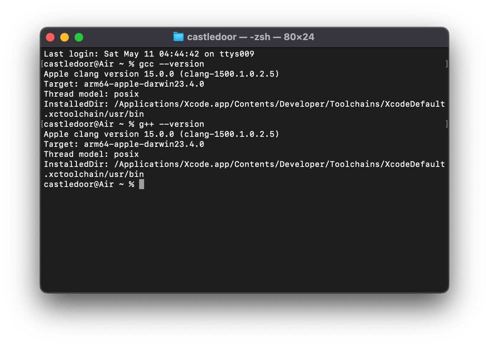
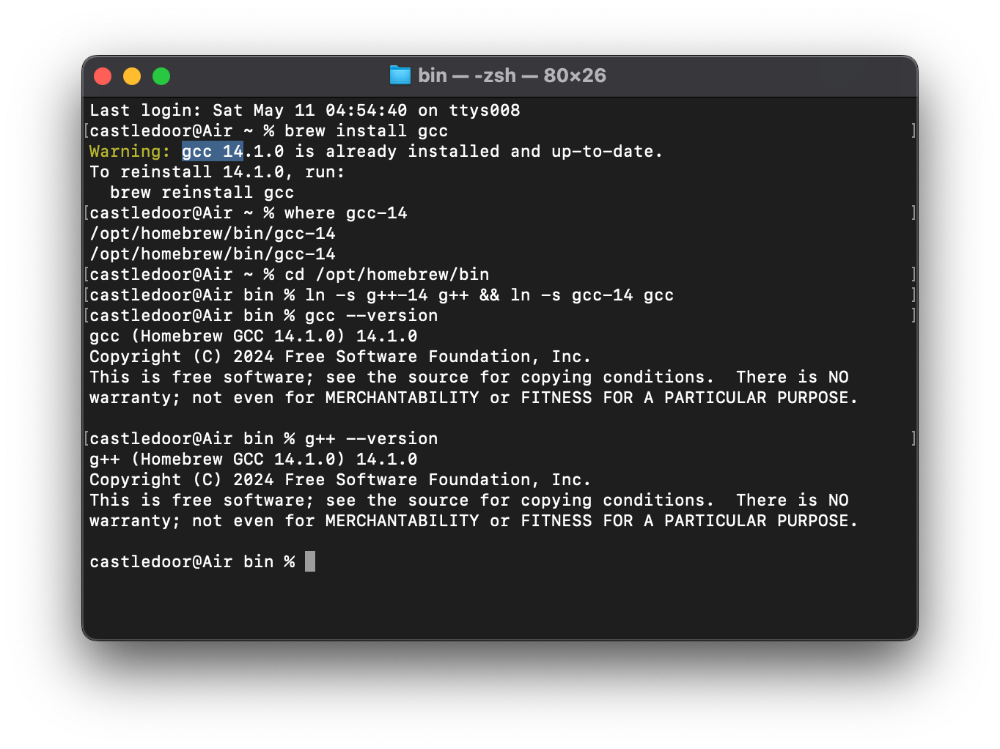

## macOS에서 Apple clang 대신 gcc/g++를 사용하려면:

1. `brew install gcc`
2. `where gcc-{설치된 버전}` 명령으로 설치 경로 확인
3. 설치 경로로 이동
4. `ln -s g++-{설치된 버전} g++` 명령으로 심볼릭 링크 만들기
5. `g++ --version` 명령을 실행하면 Apple clang 대신 Homebrew GCC가 실행되는 것 확인
